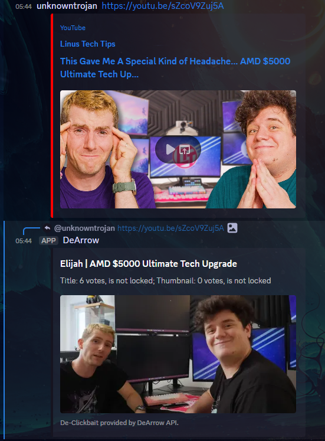

# DeArrow Discord Bot

This Discord bot uses the DeArrow API to de-clickbait YouTube videos sent in Discord chats.

## Example

## Usage

Since this was a 2 hour quickie project, it is very simple and not very configurable.

Register a Discord application on the Discord developer portal.

It requires the following permissions: `Attach Files, Embed Links, Read Message History, Send Messages, View Channels`.

It is now 6am, this is super half baked, lmao
